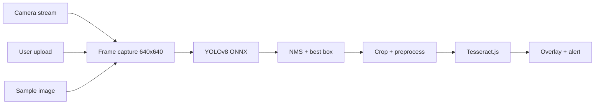

# YOLO License Plate Detector

[](https://github.com/JshMarkCastillo-GHdev/yolov8-webApp-reactVite/actions/workflows/ci.yml)

A browser-based license plate detection and OCR demo. A custom YOLOv8 model (exported to ONNX) finds plates in live camera video; Tesseract.js reads the text. **All inference runs on the client** — no frames or images are sent to a server.

Built as a lightweight portfolio piece: train in Python, ship inference in the browser.

---

## Demo

| | |
|---|---|
| **Detection** | Custom YOLOv8 → ONNX (`best.onnx`, ~5.9 MB) |
| **OCR** | Tesseract.js (English, plate character whitelist) |
| **Runtime** | ONNX Runtime Web (WASM, single-threaded for mobile safety) |
| **Privacy** | Camera and uploads stay local; no backend required |

> **Note:** Real-time WASM inference is CPU-heavy. Desktop works well; mobile may be slow or unstable.

### Input modes

| Tab | Use case | Data leaves browser? |
|-----|----------|----------------------|
| **Camera** | Live detection (default) | No |
| **Upload** | Analyse a local photo | No — processed in memory only |
| **Samples** | Curated demo images | Only static assets you ship in `public/samples/` |

---

## Tech Stack

| Layer | Current | Notes |
|-------|---------|-------|
| UI | React 19 | Single-page app |
| Build | Vite 7 | Fast dev, static deploy |
| Language | TypeScript (strict) | Already in use |
| Styling | Tailwind CSS 4 + DaisyUI | Dark/light theme |
| Detection | ONNX Runtime Web | Loaded via CDN in `index.html` |
| OCR | Tesseract.js 7 | npm package (no CDN drift) |
| Training (external) | Python / Ultralytics YOLOv8 | Not yet in this repo |

See [AGENTS.md](./AGENTS.md) for agent conventions, a proposed Next.js layout, and team delegation.

---

## Project Structure

```
yolov8-webApp-reactVite/
├── .github/
│   └── workflows/
│       └── ci.yml                   # Lint, validate samples, build
├── README.md
├── AGENTS.md
└── frontend/
    └── yolo-plate-webApp/
        ├── public/
        │   ├── models/
        │   │   └── best.onnx          # Trained YOLOv8 ONNX weights
        │   └── samples/
        │       ├── samples.json       # Gallery manifest
        │       └── README.md          # How to add safe sample images
        ├── src/
        │   ├── App.tsx                # Orchestrator (modes + layout)
        │   ├── features/
        │   │   ├── camera/            # Live webcam + RAF loop
        │   │   ├── detection/         # YOLO preprocess, NMS, runDetection
        │   │   ├── input/             # Upload + sample gallery
        │   │   ├── ocr/               # Tesseract worker + crop preprocess
        │   │   └── plate-ui/          # Tabs, alerts, canvas
        │   ├── shared/                # Types, ort helper, image utils
        │   ├── main.tsx
        │   └── index.css
        ├── index.html                 # ONNX Runtime CDN script
        └── package.json
```

**Refactored:** Logic is split into feature modules under `src/features/` (see [AGENTS.md](./AGENTS.md)).

---

## Privacy and sample images

- **Upload tab:** Images are read from the user's device and processed entirely in the browser. Nothing is sent to a server.
- **Samples tab:** Optional curated images you place in `public/samples/`. These are public static assets (same as any image on a website).
- **Do not** add real street/surveillance plates without consent. Use your own vehicle, synthetic plates, or licensed stock. See [`public/samples/README.md`](frontend/yolo-plate-webApp/public/samples/README.md).

### Adding sample images

1. Add image files to `frontend/yolo-plate-webApp/public/samples/`.
2. Add entries to `samples.json` (see schema in `public/samples/README.md`).
3. Rebuild and push — Vercel redeploys automatically.
4. Run `npm run validate:samples` locally (also runs in CI).

---

## CI

GitHub Actions runs on every push and pull request to `master` / `main`:

| Step | Command | Purpose |
|------|---------|---------|
| Lint | `npm run lint` | ESLint + React hooks rules |
| Validate samples | `npm run validate:samples` | `samples.json` schema + image files exist |
| Build | `npm run build` | TypeScript + Vite production build |
| Verify output | — | `dist/index.html`, model, and manifest present |

```bash
cd frontend/yolo-plate-webApp
npm ci
npm run lint
npm run validate:samples
npm run build
```

Workflow file: [`.github/workflows/ci.yml`](.github/workflows/ci.yml)

---

## Getting Started

### Prerequisites

- Node.js 20+
- npm 10+
- Webcam for **Camera** tab, or use **Upload** / **Samples** without a camera
- HTTPS or `localhost` (required for `getUserMedia`)

### Install & run

```bash
cd frontend/yolo-plate-webApp
npm install
npm run dev
```

Open the URL Vite prints (usually `http://localhost:5173`). **Camera** is the default tab; switch to **Upload** or **Samples** to test without a webcam.

### Build for production

```bash
cd frontend/yolo-plate-webApp
npm run build
npm run preview   # optional local preview of dist/
```

Deploy the `dist/` folder to any static host — **Vercel is the recommended default** for this MVP (see below).

---

## Deploy — Portfolio MVP (Vercel)

**Yes — stay on Vercel for now.** This app is a static Vite SPA with no server. Render’s value is paid, always-on **backend** services; spending your $5/mo budget there before you need an API burns money on cold starts you don’t use yet.

| | Vercel (Hobby) | Render ($5/mo) |
|---|---|---|
| **This SPA** | Ideal — zero config, HTTPS, global CDN | Static sites are not Render’s strength; web services are overkill |
| **Cost now** | $0 | Better reserved for a future FastAPI worker |
| **Fast presentations** | Live URL + preview link per git push | Cold starts if you deploy a web service anyway |
| **Camera / WASM** | HTTPS out of the box (required for `getUserMedia`) | Same if configured, but more setup for no gain |

**When to use Render later:** only if you add a backend (batch image upload, model versioning API, admin). Put **frontend on Vercel**, **API on Render** — split stack, still free-ish.

### One-time Vercel setup

1. Push repo to GitHub.
2. [vercel.com](https://vercel.com) → **Add New Project** → import repo.
3. Set **Root Directory** to `frontend/yolo-plate-webApp`.
4. Framework preset: **Vite** (auto-fills build/output).
5. Deploy. You get a URL like `https://your-project.vercel.app`.

| Setting | Value |
|---------|--------|
| Root Directory | `frontend/yolo-plate-webApp` |
| Build Command | `npm run build` |
| Output Directory | `dist` |
| Install Command | `npm install` |

### On-the-go presentation checklist

- [ ] Bookmark production Vercel URL on phone + laptop.
- [ ] Test **Camera** on live HTTPS URL before any interview.
- [ ] Test **Upload** with a saved plate photo as backup.
- [ ] Add 1–2 entries to `samples.json` + images for **Samples** tab (no plate required at venue).
- [ ] Optional: `npx vercel --prod` for instant redeploy before a meeting.

```bash
# Optional CLI (npx, no global install)
cd frontend/yolo-plate-webApp
npx vercel          # preview
npx vercel --prod   # production
```

**Alternatives at $0:** Cloudflare Pages (excellent CDN, slightly more config). Skip Render for the frontend.

---

## How It Works



1. **Camera** — `getUserMedia` with rear-facing preference on mobile.
2. **Upload / Samples** — one-shot detection on a static image (no server upload).
3. **Inference loop** (camera only) — `requestAnimationFrame` redraws video every frame; YOLO runs on a throttled interval (~1.2 s) to limit CPU load.
4. **Post-processing** — YOLOv8 output transposed, confidence filter (0.35), NMS (IoU 0.45), single highest-confidence box.
5. **OCR** — Crop region, grayscale/contrast/resize, Tesseract with `SINGLE_WORD` page segmentation and alphanumeric whitelist.
6. **Persistence** (camera only) — Last good plate text and box stored in refs so overlays stay visible between inference ticks.

### Tunable constants (`features/detection/lib/constants.ts`)

| Constant | Default | Effect |
|----------|---------|--------|
| `INFERENCE_INTERVAL_MS` | 1200 | Lower = faster updates, higher CPU |
| `confThreshold` | 0.35 | Detection sensitivity |
| `iouThreshold` | 0.45 | NMS overlap tolerance |
| OCR `confidence` | ≥ 30 | Minimum Tesseract confidence to accept |

---

## Training Pipeline (outside this repo)

This repository ships the **inference app** only. The training story should be documented separately:

1. Collect / label plate images (YOLO format).
2. Train with Ultralytics YOLOv8 in Python.
3. Export: `model.export(format="onnx", imgsz=640)`.
4. Place `best.onnx` in `public/models/`.

**Portfolio tip:** Add a `training/` folder with `README.md`, `export_onnx.py`, and a sample `data.yaml` — recruiters care about the full loop, not just the demo page.

---

## Should You Migrate to Next.js + Turborepo?

**Short answer: not yet — refactor first, migrate only if scope grows.**

| Question | Answer |
|----------|--------|
| Do you need SSR/SEO for a marketing site? | Maybe → Next.js **landing** + static `/demo` is reasonable |
| Do you need a backend today? | No → Next.js API routes add little over a Vite SPA |
| Do you have 2+ packages to share code? | No → Turborepo monorepo is premature |
| Is TypeScript missing? | No — you already use strict TS |

**Better order of operations (free tier):**

1. ~~Split `App.tsx` into feature modules~~ (done).
2. ~~Fix Tesseract version alignment~~ (done — uses npm package).
3. ~~Add upload + sample gallery~~ (done).
4. Add CI (lint + build) and one Playwright smoke test.
5. Deploy static build to **Vercel** ($0) — keep Render $5 budget for a future API only.
6. **Then** consider Next.js if you add: blog/docs, auth, detection history API, or admin dashboard.

A Next.js monorepo shines when you have `apps/web`, `packages/inference`, `packages/ui`, and maybe `apps/api` — not for a single camera demo.

---

## Roadmap (portfolio-focused, $0 budget)

- [x] Refactor into feature-based folders (camera, detection, ocr, ui)
- [x] Image upload / sample gallery demo (no webcam required)
- [ ] Model card page (dataset size, mAP, export date, limitations)
- [ ] `training/` docs + export script in repo
- [x] GitHub Actions: lint, build, samples validation
- [ ] ONNX WebGPU backend toggle (where supported)
- [x] Deploy to Vercel (production URL for presentations)
- [ ] Optional later: FastAPI on Render ($5/mo) for **batch** image OCR — frontend stays on Vercel

---

## License

Add a license file if you plan to open-source (MIT is typical for portfolio repos).

## Author

[GitHub — JshMarkCastillo-GHdev](https://github.com/JshMarkCastillo-GHdev)
